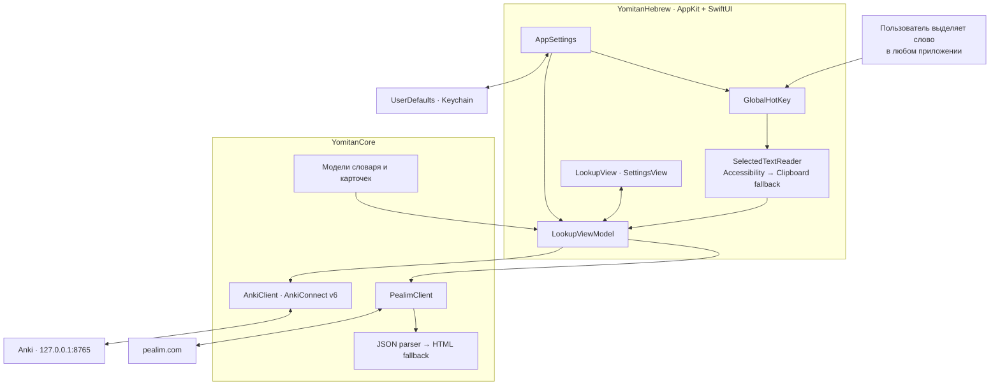

# Yomitan Hebrew for macOS

Нативный macOS‑клиент для быстрого поиска выделенного слова на иврите и добавления выбранного результата в Anki.

Подробности сетевого взаимодействия: [интеграция с Pealim](docs/pealim-integration.md).

## Что уже работает

- настраиваемая глобальная горячая клавиша (`⌥⌘H` по умолчанию);
- чтение выделенного текста через macOS Accessibility API;
- резервное копирование через `⌘C` с восстановлением предыдущего содержимого буфера обмена;
- поиск словоформ на русском разделе Pealim;
- выбор результата при омонимии и неоднозначном разборе;
- редактирование перевода, транскрипции и грамматической пометы перед сохранением;
- добавление напрямую в Anki или открытие заполненного окна добавления;
- автоматическое создание колоды `Hebrew::Pealim` и типа заметки `Hebrew Pealim`;
- необязательный API key AnkiConnect хранится в macOS Keychain.

## Сборка и запуск

Нужны macOS 13 или новее и Xcode 16 или новее.

```bash
./Scripts/build-app.sh
open "dist/Yomitan Hebrew.app"
```

Готовое приложение появится в `dist/Yomitan Hebrew.app`. Если в системе выбран только Command Line Tools, скрипт автоматически использует Xcode из `/Applications/Xcode.app`.

После первого запуска:

1. Разрешите **Yomitan Hebrew** доступ в `Системные настройки → Конфиденциальность и безопасность → Универсальный доступ`.
2. Установите AnkiConnect: в Anki откройте `Tools → Add-ons → Get Add-ons`, введите `2055492159` и перезапустите Anki.
3. Оставьте Anki запущенным, выделите слово и нажмите `⌥⌘H`.

Чтобы сменить сочетание, откройте меню приложения в строке меню, выберите **Настройки…**, нажмите на текущее сочетание и введите новое. `Esc` отменяет запись, а кнопка **Вернуть ⌥⌘H** восстанавливает значение по умолчанию.

AnkiConnect по умолчанию доступен только локально по `http://127.0.0.1:8765`. Приложение не меняет этот адрес и не запускает автоматическую синхронизацию AnkiWeb.

## Архитектура



- `YomitanHebrew` отвечает за интерфейс, глобальный хоткей и интеграцию с macOS.
- `YomitanCore` содержит модели, парсеры Pealim и клиент AnkiConnect без зависимости от интерфейса.
- Все внешние запросы проходят через `PealimClient` и `AnkiClient`, поэтому их можно тестировать отдельно.

## Разработка и тесты

```bash
export DEVELOPER_DIR=/Applications/Xcode.app/Contents/Developer
swift build --disable-sandbox
swift test --disable-sandbox
```

## Pealim и распространение

Это неофициальный клиент. Pealim не публикует стабильный API или явную лицензию на повторное распространение словарной базы и аудио. Текущая версия делает только запрос выбранного пользователем слова и сохраняет ссылку на исходную статью.

Для личного учебного использования это разумный MVP. Перед публичным или коммерческим релизом нужно получить разрешение Pealim; не следует включать в приложение полный дамп словаря или коллекцию аудиофайлов без такого разрешения.

## Ограничения MVP

- приложение собрано с ad-hoc подписью и пока не notarized;
- поля с защищённым вводом намеренно не читаются;
- Pealim может изменить недокументированный формат ответа, поэтому сохранён HTML‑fallback и fixture‑тесты;
- автоматические UI‑тесты системного Accessibility‑разрешения требуют отдельного подписанного test host.
